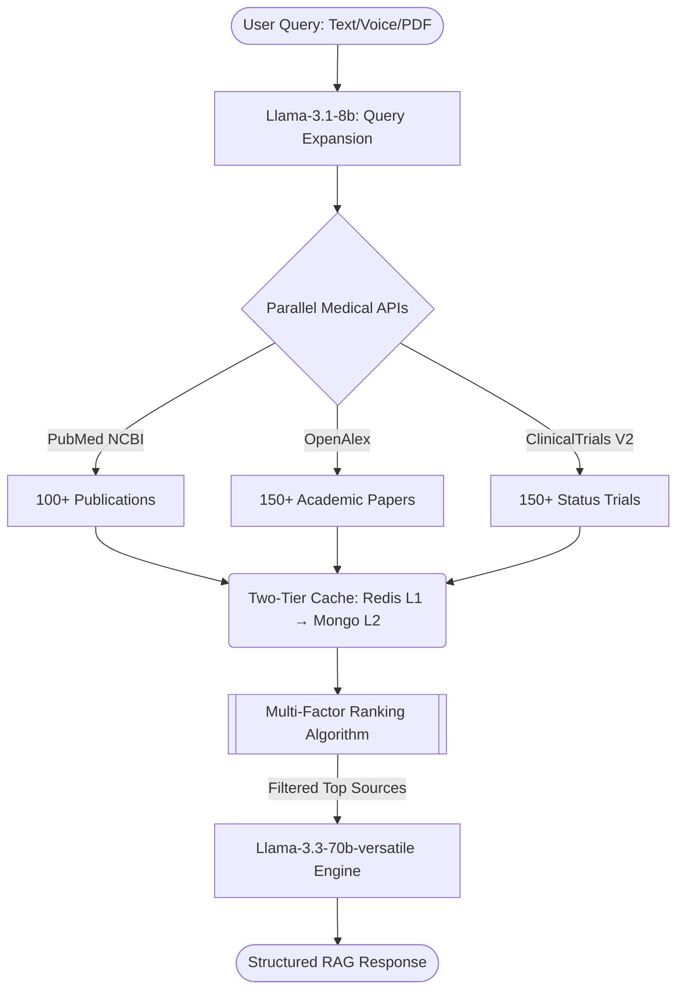

<div align="center">
  
  <h1>🧬 Curalink</h1>
  <p><strong>A Precision AI Medical Research Workstation for Clinicians and Patients.</strong></p>

  <p>
    <a href="#features"></a>
    <a href="#architecture"></a>
    <a href="#quick-start"></a>
  </p>

  <p>
    
    
    
    
    
  </p>
</div>

---

> **Curalink** breaks the barrier between complex clinical data and accessible insights. It dynamically retrieves, actively ranks, and intelligently reasons over live global research data from **PubMed**, **OpenAlex**, and **ClinicalTrials.gov** to deliver highly structured, actionable medical intelligence in seconds.

## ✨ High-Impact Features

<table>
  <tr>
    <td width="50%">
      <h3>🎙️ Realtime Voice AI (Sarvam WebSockets)</h3>
      <p>Communicate seamlessly hands-free. Real-time audio multiplexing streams directly via WebSockets to a Sarvam pipeline, featuring dynamic live captions and a custom "Thinking" particle-orb visualizer.</p>
    </td>
    <td width="50%">
      <h3>🗺️ Global Trials Heatmap</h3>
      <p>We geocode live data from the ClinicalTrials.gov API to render a <strong>high-performance Leaflet Heatmap</strong>, providing researchers instantaneous visual insights into clinical access hubs and density worldwide.</p>
    </td>
  </tr>
  <tr>
    <td width="50%">
      <h3>🗂️ 3-Pane Precision Workstation</h3>
      <p>The UI elegantly transitions from a simple chat to a dense research dashboard featuring <strong>Navigational History</strong>, the <strong>Central Medical Canvas</strong>, and a <strong>Right Contextual Panel</strong> (live metrics, top researcher profiles, and caches).</p>
    </td>
    <td width="50%">
      <h3>📄 Multi-Modal Medical Vision</h3>
      <p>Simply drag and drop medical PDFs or imaging. Curalink utilizes <strong>Multer</strong>, <strong>Cloudinary</strong>, and <strong>Llama-3.2-90b-vision</strong> to instantly ingest and parse clinical document payloads directly into the active chat flow.</p>
    </td>
  </tr>
</table>

### 🔒 Persistent Clinical Profiles (Google OAuth)
Log in securely via Google native OAuth. Configure default medical profiles (e.g. *Disease: Cystic Fibrosis | Hub: NY*) in your **Settings Router**. These contexts bypass the chat entirely and are intelligently merged into the AI retrieval pipeline automatically.

---

## 🏗️ The Multi-Factor RAG Architecture

Curalink is significantly more capable than a standard chatbot. It operates an advanced parallel Retrieval-Augmented Generation (RAG) pipeline optimized for millisecond latency on Groq hardware.

<details>
<summary><b>View the Pipeline Workflow Diagram (Click to expand)</b></summary>
<br>


</details>

1. **Intelligent Expansion**: Transforms simple questions into highly structured SNOMED/MeSH targeted queries.
2. **Parallel Polling**: Queries multiple data lakes simultaneously.
3. **Data Ranking Algorithm**: 
   - *Publications*: Relevance (40%) + Recency (25%) + Credibility (20%) + Citations (15%)
   - *Trials*: Relevance (35%) + Status (25%) + Location (25%) + Recency (15%)
4. **Context Injection**: Top results are mapped and injected into the 70B reasoning framework.

---

## 🚀 Quick Start / Setup Guide

### 1. Requirements
Ensure you have the following installed:
* Node.js v18.00+
* MongoDB setup (Local or Atlas)
* *Optional*: Redis Server (Auto-degrades to MongoDB cache if offline)

### 2. Installation
```bash
git clone https://github.com/rajvveer/hackathone3.git
cd hakathone3

# Install the server dependencies
cd server && npm install

# Install the frontend dependencies
cd ../client && npm install
```

### 3. Environment Variables
Create `.env` in the `/server` directory and `.env.local` in the `/client` directory.

**`server/.env`**
```env
PORT=5000
GROQ_API_KEY=your_groq_api_key
SARVAM_API_KEY=your_sarvam_api_key
CLOUDINARY_URL=your_cloudinary_url
GOOGLE_CLIENT_ID=your_google_oauth_client_id
JWT_SECRET=super_secure_jwt_secret
MONGODB_URI=mongodb://localhost:27017/curalink
REDIS_URL=redis://127.0.0.1:6379 
```

**`client/.env.local`**
```env
VITE_GOOGLE_CLIENT_ID=your_google_oauth_client_id
```

### 4. Ignite the Engines
```bash
# Terminal 1 — Fire up the robust Express + WebSockets backend
cd server && npm run dev

# Terminal 2 — Boot the React UI
cd client && npm run dev
```

Visit **[http://localhost:5173](http://localhost:5173)** in your browser to experience Curalink. 

---

## 🛠️ The Tech Stack

Curalink was engineered for absolute performance.

<div align="center">
  
| Domain | Technologies |
| :--- | :--- |
| **Frontend** | React 19, Vite, React-Leaflet, OAuth2, Vanilla Glassmorphic CSS |
| **Backend** | Node.js, Express, Socket.IO (WebSockets), Multer, SSE Event Streams |
| **Databases** | MongoDB Core, Redis In-Memory L1 Cache, Cloudinary Storage |
| **Generative SDKs** | Groq SDK, Sarvam API, Ollama (Local Fallback Compatibility) |
| **Inference Models** | Llama 3.3 70B, Llama 3.1 8B, Llama 3.2 90B Vision, Bulbul V3 |

</div>

<br>
<p align="center">
  <i>Developed for the Hackathon. Innovating the speed of medical intelligence.</i>
</p>
